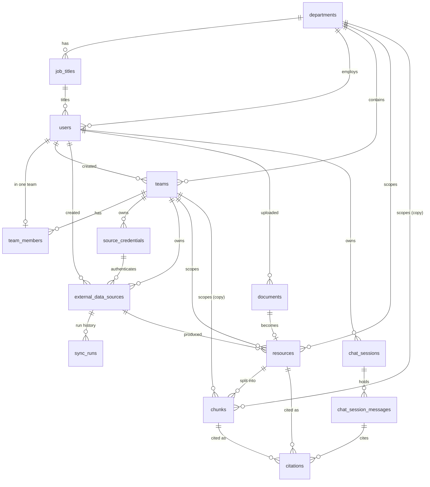

# Entity Reference

[← Documentation](README.md) · Long form: [entities.md](entities.md)

A condensed map of every persisted table, its columns, its enums and its
relations — enough to write correct queries and services without reading
`app/entities/` first. Where this page and the code disagree, the code wins.

## Two kinds of model, one rule

| Package | Kind | Lifetime |
| --- | --- | --- |
| `app/entities/` | SQLAlchemy 2.0 declarative ORM (`Mapped[...]`, `mapped_column`) | Rows in PostgreSQL |
| `app/models/` | Pydantic DTOs (requests, responses, connector payloads) | One request, then gone |

Nothing in `app/models/` is a table. Entities never leave the service layer as
themselves — a retrieval hit is mapped into `RetrievedChunk`, not serialised
from `Chunk` (the entity carries a 1536-float vector).

## Shared base

`app/entities/base.py`

- **`Base`** — one `DeclarativeBase`, one `MetaData`, with a naming convention
  (`pk_`, `fk_`, `uq_`, `ix_`, `ck_` prefixes) so migrations get stable names.
- **`UUIDMixin`** — `id: UUID` primary key, `default=uuid.uuid4`, `sort_order=-100`
  (always the first column).
- **`TimestampMixin`** — `created_at` / `updated_at`, `DateTime(timezone=True)`,
  `NOT NULL`, `server_default=now()`, `updated_at` also `onupdate=now()`,
  `sort_order=100` (always last).

Every table below is `class X(UUIDMixin, TimestampMixin, Base)`, so assume
`id`, `created_at`, `updated_at` exist; they are not repeated in the tables.

## Enum catalogue

All are `str, Enum` in Python and **native PostgreSQL enums**, named by the
`name=` argument; values equal the upper-case member names.

| Python enum | PG type name | Values |
| --- | --- | --- |
| `ApplicationRole` | `application_role` | `SUPER_ADMIN`, `HR`, `EMPLOYEE` |
| `MemberRole` | `member_role` | `TEAM_LEAD`, `TEAM_MEMBER` |
| `SourceType` | `source_type` | `GITHUB`, `JIRA`, `CONFLUENCE`, `SLACK` |
| `SourceStatus` | `source_status` | `ACTIVE`, `INACTIVE`, `ERROR` |
| `CredentialType` | `credential_type` | `GITHUB`, `JIRA`, `CONFLUENCE`, `SLACK` |
| `SyncRunStatus` | `sync_run_status` | `PENDING`, `RUNNING`, `COMPLETED`, `FAILED` |
| `DocumentStatus` | `document_status` | `UPLOADED`, `PROCESSING`, `READY`, `FAILED` |
| `ResourceType` | `resource_type` | `GITHUB_FILE`, `JIRA_ISSUE`, `CONFLUENCE_PAGE`, `SLACK_MESSAGE`, `DOCUMENT` |
| `ResourceAccessScope` | `resource_access_scope` | `TEAM`, `DEPARTMENT`, `ORGANIZATION` |
| `MessageRole` | `message_role` | `USER`, `ASSISTANT` |

`chunks.chunk_type` is deliberately **not** an enum — a free `String(255)`
(`symbol_type` for GitHub, the issue type for Jira, `PAGE`, `MESSAGE`), because
the first two are open sets that would otherwise cost an `ALTER TYPE`.

## The shape of it

## organization

### `departments`
| Column | Type | Null | Notes |
| --- | --- | --- | --- |
| `name` | `String(255)` | no | unique, indexed |
| `description` | `Text` | yes | |

Relations: `job_titles`, `users`, `teams`, `resources`, `chunks` (all one-to-many).

### `job_titles`
| Column | Type | Null | Notes |
| --- | --- | --- | --- |
| `department_id` | `Uuid` FK → `departments.id` | no | |
| `name` | `String(255)` | no | |
| `description` | `Text` | yes | |

Constraint: `UNIQUE (department_id, name)` — titles are unique inside a department.

### `users`
| Column | Type | Null | Notes |
| --- | --- | --- | --- |
| `email` | `String(320)` | no | unique, indexed |
| `username` | `String(150)` | yes | unique |
| `password_hash` | `String(255)` | no | hash only |
| `first_name` / `last_name` | `String(255)` | no | |
| `department_id` | `Uuid` FK → `departments.id` | yes | indexed |
| `job_title_id` | `Uuid` FK → `job_titles.id` | yes | indexed |
| `application_role` | `application_role` enum | no | default `EMPLOYEE` |
| `is_active` | `Boolean` | no | default `true` |

Relations: `department`, `job_title`, `created_teams`, `team_membership`
(**scalar or `None`** — `team_members.user_id` is unique),
`created_external_data_sources`, `documents`, `chat_sessions`.

## teams

### `teams`
| Column | Type | Null | Notes |
| --- | --- | --- | --- |
| `department_id` | `Uuid` FK → `departments.id` | no | |
| `name` | `String(255)` | no | |
| `description` | `Text` | yes | |
| `created_by_user_id` | `Uuid` FK → `users.id` | no | indexed |

Constraint: `UNIQUE (department_id, name)`.
Relations: `department`, `creator`, `team_members`, `source_credentials`,
`external_data_sources`, `resources`, `chunks`.

### `team_members`
| Column | Type | Null | Notes |
| --- | --- | --- | --- |
| `team_id` | `Uuid` FK → `teams.id` | no | indexed |
| `user_id` | `Uuid` FK → `users.id` | no | **unique** — one team per user |
| `member_role` | `member_role` enum | no | default `TEAM_MEMBER` |
| `joined_at` | `DateTime(tz)` | no | `server_default=now()`; a service may backdate it, `created_at` is when the row was written |

Moving teams **replaces** the row; it never adds a second one.

## data_sources

### `source_credentials`
| Column | Type | Null | Notes |
| --- | --- | --- | --- |
| `team_id` | `Uuid` FK → `teams.id` | no | indexed |
| `credential_type` | `credential_type` enum | no | which provider this authenticates against |
| `secret_reference` | `String(512)` | yes | pointer into a future secret manager |
| `encrypted_secret` | `Text` | yes | ciphertext only — there is no plaintext column here |
| `credential_metadata` | `JSON`/`JSONB` | yes | non-secret context (`auth_type`, `account_email`) |

### `external_data_sources`
One connected system: a repository, a Jira project, a Confluence space, a channel.

| Column | Type | Null | Notes |
| --- | --- | --- | --- |
| `team_id` | `Uuid` FK → `teams.id` | no | indexed |
| `credential_id` | `Uuid` FK → `source_credentials.id` | yes | nullable only because the source row is written first |
| `created_by_user_id` | `Uuid` FK → `users.id` | no | indexed |
| `name` | `String(255)` | no | display name, deliberately not unique |
| `source_type` | `source_type` enum | no | indexed |
| `status` | `source_status` enum | no | default `ACTIVE`, indexed — the connection's state, not a run's |
| `config` | `JSON`/`JSONB` | yes | `repository`, `branch`, `site_url`, `project_key`, `channel_id` — never a secret |
| `token` | `String(2048)` | yes | **plaintext access token, interim** — see [todo.md](todo.md) |
| `last_synced_at` | `DateTime(tz)` | yes | written by the ingestion service |

Relations: `team`, `credential`, `creator`, `sync_runs`, `resources`.

### `sync_runs`
One ingestion attempt. The team is reached through the source, never copied here.

| Column | Type | Null | Notes |
| --- | --- | --- | --- |
| `external_data_source_id` | `Uuid` FK → `external_data_sources.id` | no | indexed, the only FK |
| `status` | `sync_run_status` enum | no | default `PENDING`, indexed |
| `started_at` / `completed_at` | `DateTime(tz)` | yes | a `PENDING` run has neither; a `FAILED` one may have only the first |
| `resources_processed` | `Integer` | no | default `0` |
| `chunks_created` / `chunks_updated` / `chunks_deleted` | `Integer` | no | default `0` |
| `error_message` | `Text` | yes | |
| `run_metadata` | `JSON`/`JSONB` | yes | named `run_metadata`; `metadata` is taken by `Base.metadata` |

## documents

### `documents`
A file uploaded straight into the app rather than fetched from a connector.

| Column | Type | Null | Notes |
| --- | --- | --- | --- |
| `uploaded_by_user_id` | `Uuid` FK → `users.id` | no | who uploaded ≠ who may read |
| `original_file_name` | `String(512)` | no | kept verbatim |
| `display_name` | `String(512)` | yes | null means nobody named it |
| `mime_type` | `String(255)` | yes | client-supplied, may be absent or wrong |
| `file_size` | `BigInteger` | no | bytes, taken from the stored object |
| `storage_path` | `String(1024)` | no | path or object key; the bytes are never in the DB |
| `checksum` | `String(64)` | yes | indexed, sized for a sha256 hex digest |
| `status` | `document_status` enum | no | default `UPLOADED`, indexed |

Relations: `uploader`, `resource` (**scalar or `None`** — `resources.document_id`
is unique, so one file becomes at most one searchable item).

## knowledge_sources

### `resources`
The searchable item, and the **source of truth for access control**.

| Column | Type | Null | Notes |
| --- | --- | --- | --- |
| `external_data_source_id` | `Uuid` FK → `external_data_sources.id` | yes | origin A |
| `document_id` | `Uuid` FK → `documents.id` | yes | origin B, **unique**, indexed |
| `resource_type` | `resource_type` enum | no | indexed |
| `external_id` | `String(512)` | yes | indexed — file path, `TRACK-25`, page id, `channel:timestamp` |
| `title` | `String(1024)` | yes | |
| `version_key` | `String(255)` | yes | commit SHA / page version / checksum — "has this changed?" |
| `access_scope` | `resource_access_scope` enum | no | indexed |
| `team_id` | `Uuid` FK → `teams.id` | yes | indexed |
| `department_id` | `Uuid` FK → `departments.id` | yes | indexed |
| `resource_metadata` | `JSON`/`JSONB` | yes | `repository`, `branch`, `issue_key`, `space_key`, `channel_id` — never permission fields |

Constraints:
- `UNIQUE (external_data_source_id, external_id)` — one row per item per source.
  `external_id` alone is not unique; SQL NULLs stay distinct, so document-origin
  rows are unaffected.
- `CHECK ((external_data_source_id IS NULL) <> (document_id IS NULL))`, named
  `single_origin` — exactly one origin, never both, never neither. Written this
  way rather than with `num_nonnulls()` so it also compiles on SQLite.

Relations: `external_data_source`, `document`, `team`, `department`,
`chunks` (`cascade="all, delete-orphan"`), `citations` (**no cascade** — deleting
a cited resource is refused).

## chunks

### `chunks`
The embeddable unit, the retrieval unit, and the only table carrying a vector.

| Column | Type | Null | Notes |
| --- | --- | --- | --- |
| `external_data_source_id` | `Uuid` | yes | half of the composite FK below |
| `external_id` | `String(512)` | yes | the other half |
| `chunk_index` | `Integer` | no | position within its resource |
| `chunk_type` | `String(255)` | yes | indexed, free string (see enum note above) |
| `content` | `Text` | no | the embedded text, stored beside its vector |
| `embedding` | `VECTOR(1536)` | yes | `EMBEDDING_DIMENSIONS = 1536`; null until the embedding pass runs |
| `embedding_model` | `String(255)` | yes | which model produced the vector |
| `chunk_metadata` | `JSON`/`JSONB` | yes | `symbol_name`, `start_line`, `repository`, `branch`, `space_key`, `project_key` |
| `access_scope` | `resource_access_scope` enum | no | indexed — **copy** of the resource's |
| `team_id` | `Uuid` FK → `teams.id` | yes | indexed — **copy** |
| `department_id` | `Uuid` FK → `departments.id` | yes | indexed — **copy** |

Constraints:
- Composite FK `(external_data_source_id, external_id)` →
  `(resources.external_data_source_id, resources.external_id)`, named
  `fk_chunks_resource`. **There is no `resource_id` column.**
- `UNIQUE (external_data_source_id, external_id, chunk_index)` — the index is
  scoped to the (source, item) pair, so two repositories each holding a
  `README.md` do not collide at every index.

Neither constraint reaches a **document-origin chunk**, whose two key columns are
both `NULL`; `chunk.resource` resolves to `None` there.

Relations: `resource` (optional), `team`, `department`, `citations`.

## chat

### `chat_sessions`
| Column | Type | Null | Notes |
| --- | --- | --- | --- |
| `user_id` | `Uuid` FK → `users.id` | no | indexed; a session belongs to one person and is never shared |
| `title` | `String(255)` | yes | null until something names it |

### `chat_session_messages`
| Column | Type | Null | Notes |
| --- | --- | --- | --- |
| `chat_session_id` | `Uuid` FK → `chat_sessions.id` | no | indexed |
| `role` | `message_role` enum | no | `USER` or `ASSISTANT` |
| `content` | `Text` | no | one turn per row — a question and its answer are two rows |

No sequence column: order is recovered from `created_at`.

### `citations`
| Column | Type | Null | Notes |
| --- | --- | --- | --- |
| `chat_message_id` | `Uuid` FK → `chat_session_messages.id` | no | the assistant message, not the session |
| `chunk_id` | `Uuid` FK → `chunks.id` | no | indexed — the exact retrieved text |
| `resource_id` | `Uuid` FK → `resources.id` | no | indexed |
| `citation_order` | `Integer` | no | position in the answer's source list, so `[1]`/`[2]` survive a re-read |

Constraint: `UNIQUE (chat_message_id, citation_order)`.
Citations are empty for `USER` rows and for any `ASSISTANT` row that retrieved
nothing — a real state, not a missing one.

## The access model in one place

`access_scope` decides which scope column is meaningful:

| `access_scope` | `team_id` | `department_id` |
| --- | --- | --- |
| `TEAM` | set | null |
| `DEPARTMENT` | null | set |
| `ORGANIZATION` | null | null |

**The schema does not enforce that pairing** — a service must. `resources` holds
the truth; the three columns on `chunks` are a denormalised copy so a vector
search can filter rows before ranking them, and nothing in the schema keeps the
copy in step (the ingestion service does). See [todo.md](todo.md).

A retrieval filter therefore reads: chunks whose `access_scope = ORGANIZATION`,
plus `TEAM` chunks matching the caller's `team_id`, plus `DEPARTMENT` chunks
matching the caller's `department_id`.

## DTOs worth knowing

| Model | Where | Role |
| --- | --- | --- |
| `PermissionScope` | `app/models/common/permission_scope.py` | `team_id`, `department_id`, `access_scope` (default `TEAM`), `external_data_source_id` — what ingestion stamps onto resources and chunks |
| `EmbeddingCounts` | `app/models/common/embedding_counts.py` | per-run tally: `chunks`, `embeddings`, `embedding_batches`, `embedding_model`, `embedding_dimensions`, `truncated_inputs` |
| `RetrieveRequest` | `app/models/retrieval/request.py` | `query` (1–4,000 chars), `top_k` (1–50, default 10), `team_id`, `department_id`, `external_data_source_id`, `min_score` (0–1); `extra="forbid"` |
| `RetrievedChunk` / `RetrieveResponse` | `app/models/retrieval/response.py` | the chunk **without** its vector, plus `score` (cosine similarity, `1 - cosine distance`), and `resource_title` / `resource_type` read across the join |

Per-connector DTOs live under `app/models/{github,jira,confluence,slack}/` as
`file` / `issue` / `page` / `message`, `chunk`, `request`, `response` — pipeline
types, not tables.

## Rules the schema leaves to a service

1. The `access_scope` ↔ scope-column pairing is unenforced.
2. The chunk's copies of the scope columns and of its source's metadata are not kept in step by the database.
3. `documents.status` and `external_data_sources.status` are moved by services, not by triggers.
4. `external_data_sources.token` is plaintext today; `source_credentials.encrypted_secret` is where it belongs.
5. `external_data_sources.credential_id` is nullable only because of write order, not because a source may lack a credential.

[todo.md](todo.md) tracks all of these.
